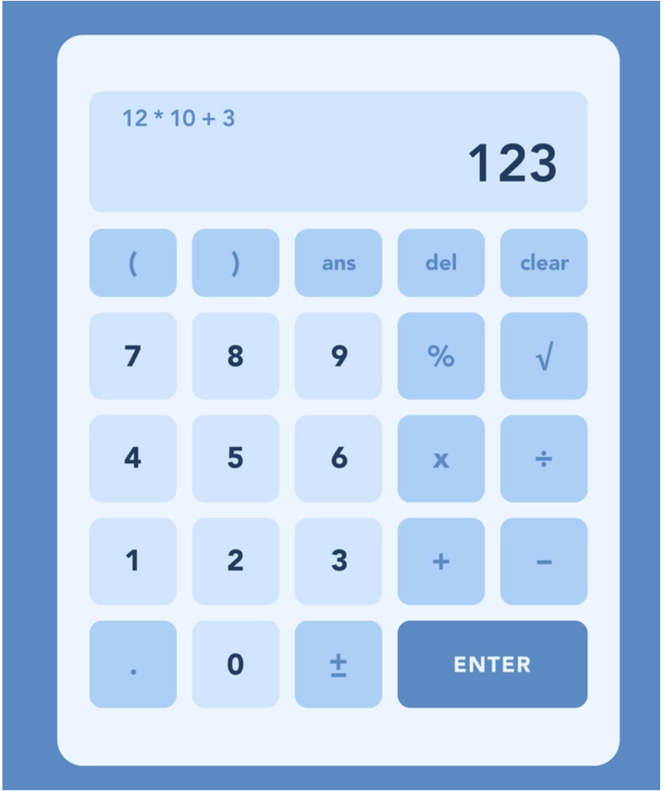
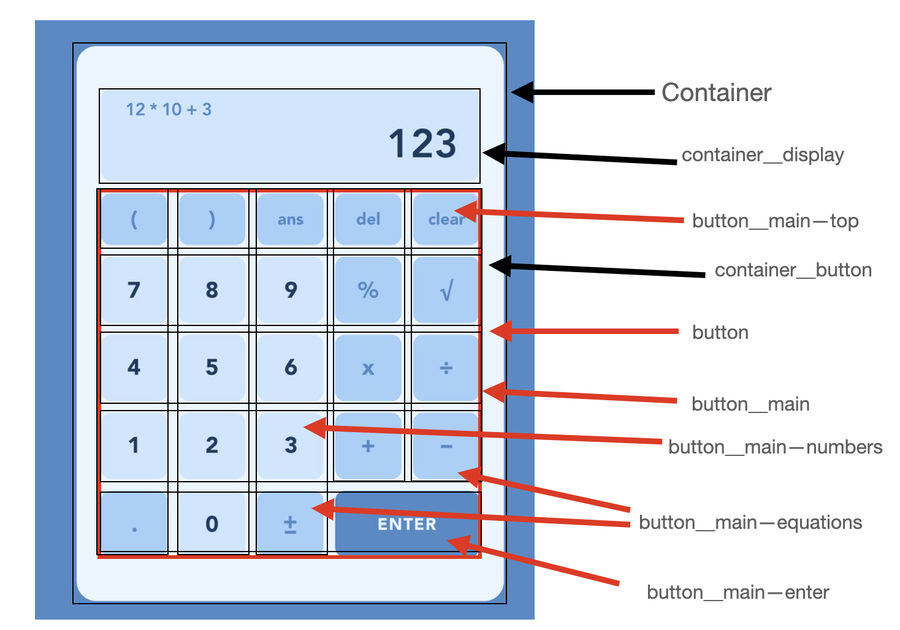

# Calculator Project!

## MVP:

## Calculator:

### JavaScript

1. Should render the current calculation in a box at the top (calculator display)
2. It should handle decimals
3. It doesn’t need to support orders of operation
4. It should not use eval() or Function() constructor

### HTML/SCSS

1. Create a calculator to be rendered to the html page
2. it should have number keys from 0 to 9
3. It should have operator keys (+, -, /, \*, =)
4. It should have a display rendering the current calculation in a box at the top
5. It should also have a “.” key
6. You should choose a picture of a calculator from the Internet and reproduce it in HTML/SCSS

## Breakdown of MVP:

In this project, I plan to recreate a calculator that will allow for inputs and outputs of numerical values. I have choosen the following calculator, as it includes the following features:

- Display screen
- Clear, Delete and Answer buttons
- Number keys from 0 to 9
- Operator keys; +,-, x, ÷
- Other features; %, √, ±, decimals and brackets.

These features listed above will meet the requirements of the MVP as well as challenge my knowledge and capabilities to include other featured keys (i.e. %, √, ±).

I have also choosen this calculator as the layout and design of this calculator is unique. I believe the different colours of the buttons will prove to me a challenge, when executing this task.

## Picture of Calculator that will be replicated

- The following images show the calculator i wish to reproduce and and a breakdown of divs and grids that will be required in order to reproduce this calculator.

